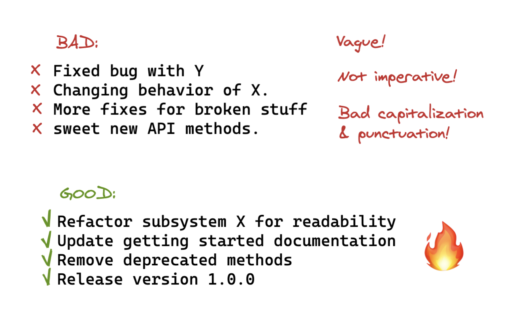

[](https://travis-ci.com/good3n/glpg-emr)

<p align="center">

</p>

<p align="center">
<strong>🚧&nbsp;&nbsp;This document is under construction&nbsp;&nbsp;🚧</strong>
<br/>
<em>Nov 11, 2020</em>
</p>

- [Getting Started](#getting-started)
  - [Working with `backend/`](#working-with-backend)
  - [Working with `frontend/`](#working-with-frontend)
- [Git Workflow](#git-workflow)
  - [Master Branch](#master-branch-the-mainline)
  - [Feature Branch](#feature-branch-making-changes)
  - [Bugs & Hotfix Branches](#bugs--hotfix-branches)
  - [Pull Requests](#pull-requests)
  - [Commit Messages](#commit-messages)
  - [Resources & Guides](#resources--guides)
- [Linting & Prettier](#linting--prettier)

## Getting Started

To get started working on this project, you will need to clone this repository to your local machine. Open your terminal and navigate to the directory you would like to clone this project to.

### Working with `backend/`

This section is under construction.

### Working with `frontend/`

1. Clone project `$ git clone https://github.com/good3n/glpg-emr.git`
2. Install dependencies `$ cd glpg-emr/frontend && npm install`
3. Fire it up with `$ npm dev` and see it on `localhost:3000`

### Frontend Structure

```
.
├── src/
│   ├── components/         # React components
│   ├── pages/              # Next.js pages (React components)
│   └── assets/
│       └── styles/         # Global styles
├── static/                 # Static assets served by Next.js
├── .babelrc                # Babel config
├── .gitignore
├── next.config.js          # Next.js config
├── package.json
├── postcss.config.js       # PostCss config
├── tailwind.config.js      # TailwindCSS config
└── README.md
```

## Git Workflow

This workflow is modeled after [GitHub Flow](https://guides.github.com/introduction/flow/). Please visit this page to view their interactive demo on how this process works.

Our core philosophy is simplicity. Some of the key points to this workflow are:

- **Code close to the master**: This helps eliminate excessive branch types that provide little benefit.
- **Make small, simple changes**: Commit, pull request, and deploy often. This will help reduce merge conflicts, make code easier to review, and makes our package easier to ship; faster velocity.

### Master Branch (The Mainline)

This workflow consists of one main branch with an infinite lifetime; the `master` branch. The master branch always consists of deployable code. Therefor all branches will be tested and pull requests will be reviewed prior to merging into the mainline.

Merging everything into the master branch, and deploying often, means you limit the amount of code in "inventory", which is in line with lean and continuous delivery best practices. **_The goal is to minimize the amount of unreleased code._**

### Feature Branch (Making changes)

A feature branch is a copy of the master branch.

1. Before you start, be sure to sync the remote master to ensure you have the latest, up-to-date copy via `$ git pull`
2. Checkout a new branch for your commits to live on without disrupting the master `$ git checkout -b feature_branch`
3. Commit often as you develop with `$ git add .` then `$ git commit -m "this is a sample commit"`
4. Push your new `feature_branch` to the repository

### Bugs & Hotfix Branches

_Under construction_

### Pull Requests

If you work on a feature branch for more than a few hours, it's good practice to share the immediate result with the rest of your team. You can @mention your teammates, and mark the merge request as a "work-in-progress" (WIP). This means it's not ready to be merged, but feedback is welcome. Your teammates can comment on the pull request. The merge request serves as a code review tool. If the review reveals shortcomings, anyone can commit and push a fix. When you feel comfortable with it to be merged, you can assign it to the person who knows the most about the codebase, or who is in charge with approving pull requests into the master branch.

### Commit Messages

Commit messages should adequately communicate why a change was made, which is important for making development and collaboration more efficient.

Check out 👉[this](https://chris.beams.io/posts/git-commit/)👈 🔥 article on how to write better commit messages.

1. Separate subject from body with a blank line (if body is necessary)
2. Limit the subject line to 50 characters
3. Capitalize the subject line
4. Do not end the subject line with a period
5. Use the imperative mood in the subject line
6. Wrap the body at 72 characters (if body is necessary)
7. Use the body to explain what and why vs. how (if body is necessary)
8. Do not assume the reviewer understands what the original problem was, ensure you add it.

_\*Note that in most cases, a commit does not require a subject AND a body. Usually a single subject line is fine._

<p align="center">

</p>

### In Summary

- **Use feature branches, no direct commits on master**: You should create a "feature" branch for whatever you’re working on, so that you end up doing a code review during a pull request before you merge.
- **Perform code reviews before merges into master, not afterwards**: Don't test everything at the end of your week. Do it on the spot, because you'll be more likely to catch things that could cause problems and others will also be working to come up with solutions.
- **Everyone starts from master, and targets master**: This means you don’t have any long branches. You check out master, build your feature, create your pull request, and target master again. You should do your complete review _before_ you merge, and not have any intermediate stages.
- **Commit messages reflect intent**: You should not only say what you did, but also why you did it.

### Resources & Guides

**GitHub Flow**: https://guides.github.com/introduction/flow/  
**How to code review a pull request**: https://www.youtube.com/watch?v=HW0RPaJqm4g  
**Continuous Integration & Delivery (CI/CD)**: https://www.youtube.com/watch?v=xSv_m3KhUO8

## Linting & Prettier

This project is pre-packaged with linting and prettier packages in the root directory.

It is recommended to install the [Prettier](https://marketplace.visualstudio.com/items?itemName=esbenp.prettier-vscode) and [ESLint](https://marketplace.visualstudio.com/items?itemName=dbaeumer.vscode-eslint) extensions for Visual Studio Code. You can edit your VSCode User settings/preferences and set the `Format On Save` option to `true`.
